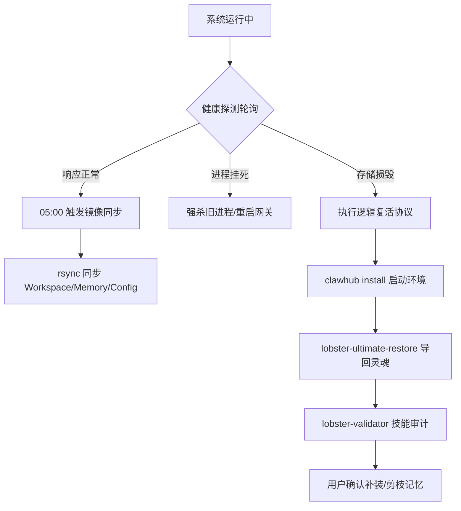

# 🐉 龙虾守护 (OpenClaw-Sys-Guardian-Resurrection) 核心技术白皮书

> **版本：** v4.1.4-Dragon  
> **保密等级：** 系统核心规约  
> **设计人：** 龙虾指挥官 (Lobster Commander) & 李良 (Technical Director)

---

## 1. 设计目标 (Design Objectives)
本系统旨在解决 AI Agent 在长期自治运行中的“生存”与“一致性”死结，具体目标包括：
- **零丢失灾备 (Zero-Loss Backup)**：通过物理介质隔离，确保在 `$HOME` 目录损毁时，依然保留完整的人格与资产。
- **逻辑一致性 (Logical Consistency)**：确保恢复后的 Agent 记忆（知道做什么）与其身体工具（能做什么）100% 匹配。
- **无人值守自愈 (Unattended Self-Healing)**：通过系统级定时探测，实现分钟级的进程挂死自动重启与环境纠偏。

---

## 2. 设计原理与技术架构 (Architecture & Philosophy)
### 2.1 设计原理
采用**“离体生命支持”**哲学。将 Agent 视作“逻辑灵魂”与“运行躯体”的组合。灵魂（MD 设定与记忆）持续向外部镜像区辐射同步，以便在躯体损毁时随时通过镜像重塑。

### 2.2 技术架构
- **数据层 (Vault Layer)**：基于 `rsync` 增量同步算法，利用 macOS 本地文件系统的高可靠性建立 `OpenClaw_Mirror`。
- **探测层 (Probe Layer)**：利用 macOS `launchd` 服务与 `gateway` RPC 端点建立健康探测。
- **自愈层 (Heal Layer)**：由一组具有高执行权限的 `/bin/bash` 脚本构成，不依赖 Agent 框架本身。

---

## 3. 运行流程结构 (Workflow Diagram Logic)


---

## 4. 功能模块详解 (Functional Modules)

### 4.1 龙镜同步 (Lobster-Mirror Sync)
- **作用**：将生产环境的动态资产（记忆、配置、情报）镜像至安全区。
- **运行方式**：由 Cron / `lobster-snapshot.sh` 执行。
- **关键要点**：使用 `--delete` 参数确保副本与源码 1:1 动态一致。

### 4.2 终极复活协议 (Ultimate Restore)
- **作用**：全量从备份区回导数据。
- **运行方式**：手动或在初始化阶段自动调用 `lobster-ultimate-restore.sh`。
- **关键要点**：必须清空 `.openclaw` 冲突文件，确保恢复后的配置版本唯一。

### 4.3 技能树验证与清创 (Skill-Validator)
- **作用**：解决 Agent “以为能做却没工具”的幻觉。
- **运行方式**：
  - **审计**：搜索 `AGENTS.md` 提取关联工具名。
  - **清创**：若工具缺失且用户决定不安装，则物理删除 `AGENTS.md` 中的对应 SOP 块。
- **关键要点**：防止 Agent 陷入反复重试不存在工具的逻辑死循环。

---

## 5. 关键代码示例 (Key Code Snippets)

### 5.1 增量同步核 (Sync Core)
```bash
# 原子同步命令
rsync -av --delete --exclude 'node_modules' "$SOURCE" "$TARGET_MIRROR"
```

### 5.2 技能对齐审计核 (Audit Core)
```bash
# 扫描规约中提到的技能并与本地库对比
grep "skill" AGENTS.md | awk '{print $NF}' | while read skill; do
  if ! clawhub list | grep -q "$skill"; then
    echo "⚠️ Detection: Skill [$skill] in memory but not installed."
  fi
done
```

---

## 6. 版本迭代历程 (Version History)

- **v4.1.0 (L-Guardian)**：初步实现 LaunchAgent 进程监控与清理。
- **v4.5.2 (Decoupled)**：引入 `/storage/` 解耦缓冲区概念，解决发送失败问题。
- **v1.3.1 (Resurrection)**：今日重大更新。确立 `/Downloads/` 外部镜像与 `Ultimate Restore` 协议。
- **v4.1.4 (Enhanced)**：当前版本。实现“生产-缓冲-分发-镜像”全链路闭环，增加技能审计剪枝逻辑。

---

## 7. 运行风险与注意事项 (Risks & Precautions)
1. **路径敏感性**：脚本内硬编码了 `/Users/maxleolee/` 路径，若跨机器迁移，需优先更新脚本根目录变量。
2. **I/O 冲突**：建议将 `rsync` 定时任务设在服务器低活时段（凌晨 05:00），以防占用磁盘带宽影响情报挖掘。
3. **API 密钥安全**：虽然本地备份安全，但严禁将包含明文 Key 的镜像目录直接共享或上传至公共云盘。

---
*龙虾指挥官 🦞 - 数据永存，意志不熄。*
